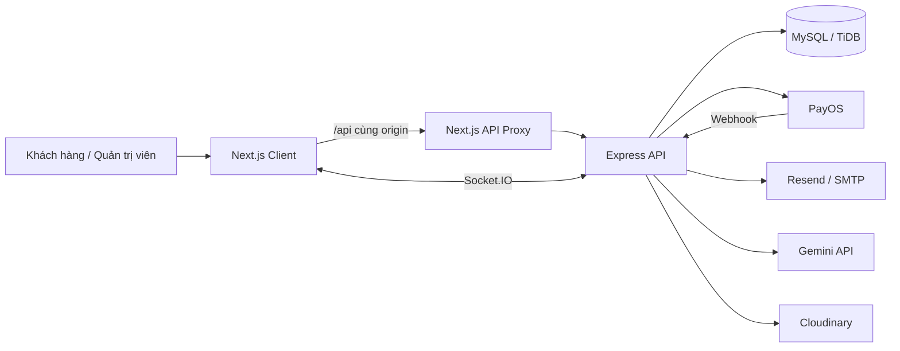
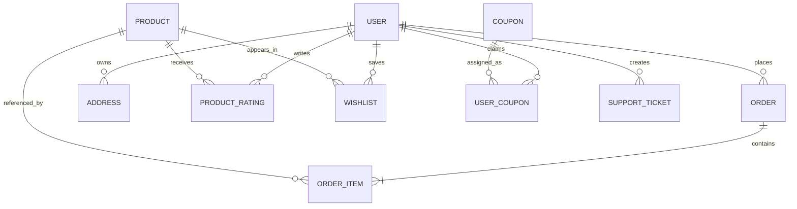

# DPWOOD Store

DPWOOD Store là hệ thống thương mại điện tử chuyên về đồ gia dụng nhà bếp. Dự án gồm website khách hàng, trang quản trị, API backend, cơ sở dữ liệu MySQL, thanh toán COD/PayOS, email giao dịch và các công cụ AI hỗ trợ vận hành.

- Website production: [https://dpwood.store](https://dpwood.store)
- Backend production: [https://dpwood.onrender.com](https://dpwood.onrender.com)
- Health check: [https://dpwood.onrender.com/api/health](https://dpwood.onrender.com/api/health)

> Không commit file `.env`, API key, mật khẩu cơ sở dữ liệu, App Password hoặc tài khoản quản trị lên Git.

## Mục lục

1. [Tính năng chính](#tính-năng-chính)
2. [Công nghệ](#công-nghệ)
3. [Kiến trúc hệ thống](#kiến-trúc-hệ-thống)
4. [Cấu trúc thư mục](#cấu-trúc-thư-mục)
5. [Khởi chạy nhanh bằng Docker](#khởi-chạy-nhanh-bằng-docker)
6. [Chạy thủ công để phát triển](#chạy-thủ-công-để-phát-triển)
7. [Biến môi trường](#biến-môi-trường)
8. [Vai trò và phân quyền](#vai-trò-và-phân-quyền)
9. [Các luồng nghiệp vụ](#các-luồng-nghiệp-vụ)
10. [API chính](#api-chính)
11. [Mô hình dữ liệu](#mô-hình-dữ-liệu)
12. [Dữ liệu mẫu và import/export](#dữ-liệu-mẫu-và-importexport)
13. [Kiểm tra chất lượng](#kiểm-tra-chất-lượng)
14. [Triển khai production](#triển-khai-production)
15. [Bảo mật và vận hành](#bảo-mật-và-vận-hành)
16. [Xử lý sự cố](#xử-lý-sự-cố)

## Tính năng chính

### Website khách hàng

- Xem, tìm kiếm và lọc sản phẩm theo danh mục, thương hiệu, chất liệu, giá và đánh giá.
- Xem biến thể màu sắc/kích thước, thông số đồ bếp, tồn kho, số lượng đã bán và sản phẩm liên quan.
- Thêm giỏ hàng, sản phẩm yêu thích và đánh giá sao.
- Quản lý kho mã giảm giá, áp dụng ưu đãi khi thanh toán.
- Thanh toán COD hoặc QR qua PayOS.
- Quản lý địa chỉ giao hàng, hồ sơ, lịch sử và tiến trình đơn hàng.
- Tiếp tục thanh toán đơn QR còn hiệu lực; đơn QR hết hạn được tự động hủy.
- Đăng ký/đăng nhập bằng tài khoản cục bộ hoặc Google.
- Xác minh email, quên mật khẩu và đặt lại mật khẩu.
- Đọc bài viết, gửi yêu cầu hỗ trợ và sử dụng AI tư vấn sản phẩm từ dữ liệu thật.
- Đăng ký bản tin theo cơ chế xác nhận email và có thể hủy đăng ký.

### Trang quản trị

- Dashboard tổng quan doanh thu, đơn hàng, tồn kho và hoạt động hệ thống.
- Quản lý người dùng, vai trò, trạng thái, lịch sử đăng nhập và giao dịch.
- Quản lý sản phẩm, danh mục, biến thể, thông số, tồn kho và số lượng đã bán.
- Import/export sản phẩm bằng JSON và xóa hàng loạt có xác nhận.
- Quản lý đơn hàng và cập nhật trạng thái giao hàng.
- Quản lý bài viết, thông báo, mã giảm giá, ưu đãi và ticket hỗ trợ.
- Quản lý người đăng ký bản tin, xem trước email, gửi thử, gửi chiến dịch, gửi lại và hủy chiến dịch.
- AI Center tạo nháp bài viết, sản phẩm, email và hỗ trợ xử lý ticket theo quy tắc.

### Nền tảng

- API proxy cùng origin trên production để hạn chế lỗi CORS và mixed content.
- JWT access/refresh token, Google OAuth, phân quyền theo vai trò.
- Socket.IO phục vụ thông báo thời gian thực.
- Rate limit, Helmet, giới hạn kích thước request và làm sạch HTML.
- Worker gửi email theo lô, có lưu tiến độ và tiếp tục sau khi server khởi động lại.
- Tối ưu index và dọn dữ liệu log theo lịch.
- Health endpoint nhẹ để giám sát backend Render.

## Công nghệ

| Lớp | Công nghệ |
| --- | --- |
| Frontend | Next.js 16, React 19, Ant Design 6, Axios, Recharts, React Quill |
| Backend | Node.js, Express 5, Sequelize 6, Socket.IO |
| Cơ sở dữ liệu | MySQL 8; production tương thích TiDB Cloud |
| Xác thực | JWT, refresh token, bcrypt, Google Identity Services |
| Thanh toán | COD, PayOS QR và webhook |
| Email | Resend API; SMTP/Nodemailer là phương án dự phòng |
| AI | Google Gemini REST API |
| Hình ảnh | Cloudinary, upload/proxy ảnh có giới hạn |
| Hạ tầng | Docker Compose, Vercel, Render, GitHub Actions |
| Package manager | pnpm 10 |

## Kiến trúc hệ thống



Trong mọi môi trường, trình duyệt gọi API qua đường dẫn cùng origin `/api`. Route proxy của Next.js chuyển tiếp request đến `BACKEND_API_URL`: `http://server:5000/api` trong Docker, `http://localhost:5000/api` khi chạy thủ công và backend Render trên production. Cách này không phụ thuộc port backend nhìn từ trình duyệt, giữ HTTPS cùng origin và giảm lỗi CORS.

## Cấu trúc thư mục

```text
dpwood/
|-- .github/workflows/       # Keep-alive backend Render
|-- client/                  # Next.js frontend
|   |-- public/              # Logo và tài nguyên tĩnh
|   `-- src/
|       |-- app/             # App Router: storefront, auth, admin, API proxy
|       |-- components/      # Component dùng chung
|       |-- context/         # Auth/cart và state toàn cục
|       `-- utils/           # Axios, ảnh, format và helper
|-- server/                  # Express backend
|   `-- src/
|       |-- config/          # Kết nối Sequelize
|       |-- controllers/     # Xử lý request và nghiệp vụ
|       |-- middlewares/     # Auth, role, rate limit, upload
|       |-- models/          # Sequelize models
|       |-- routers/         # API routes
|       |-- services/        # Payment, Gemini, email, DB optimization
|       `-- scripts/         # Seed và sửa encoding dữ liệu
|-- docs/                    # Tài liệu, dữ liệu mẫu và sơ đồ thanh toán
|-- docker-compose.yml
`-- README.md
```

## Khởi chạy nhanh bằng Docker

### Yêu cầu

- Docker Desktop có Docker Compose v2.
- Git.
- Các key bên thứ ba chỉ cần thiết khi dùng đúng tính năng tương ứng.

### 1. Chuẩn bị cấu hình backend

```powershell
Copy-Item server/.env.example server/.env
```

Tối thiểu hãy đổi các giá trị sau trong `server/.env`:

```dotenv
MYSQL_ROOT_PASSWORD=mot_mat_khau_local_manh
MYSQL_DATABASE=dpwood_db
JWT_SECRET=chuoi_ngau_nhien_dai
JWT_REFRESH_SECRET=chuoi_ngau_nhien_khac
REFRESH_TOKEN_PEPPER=chuoi_ngau_nhien_khac_nua
CLIENT_URL=http://localhost:3000
FRONTEND_URL=http://localhost:3000
```

Docker Compose tự ghi đè cấu hình DB của backend để kết nối container `db`; không cần sửa `DB_HOST` thành `localhost` khi chạy toàn bộ bằng Docker.

### 2. Khởi động

```powershell
docker compose up -d --build
docker compose ps
```

| Dịch vụ | Địa chỉ |
| --- | --- |
| Website | [http://localhost:3000](http://localhost:3000) |
| Backend API | [http://localhost:5000/api](http://localhost:5000/api) |
| Health check | [http://localhost:5000/api/health](http://localhost:5000/api/health) |
| MySQL | `127.0.0.1:3307` |

Kiểm tra nhanh:

```powershell
Invoke-RestMethod http://localhost:5000/api/health
Invoke-WebRequest http://localhost:3000 -UseBasicParsing
```

### 3. Xem log và dừng hệ thống

```powershell
docker compose logs -f server client
docker compose down
```

`docker compose down` không xóa dữ liệu MySQL. Chỉ dùng `docker compose down -v` khi chắc chắn muốn xóa toàn bộ volume database local.

### Trường hợp port `5000` đang được sử dụng

Tìm tiến trình/container chiếm port:

```powershell
Get-NetTCPConnection -LocalPort 5000 -ErrorAction SilentlyContinue
docker ps --format "table {{.Names}}\t{{.Ports}}"
```

Có thể dừng đúng ứng dụng gây xung đột hoặc đặt `SERVER_PORT=5001` trước khi chạy Compose. Trình duyệt vẫn gọi `/api`, nên không phải rebuild frontend khi đổi host port backend; kết nối nội bộ Docker tiếp tục dùng `server:5000`. Không dừng/xóa container không thuộc dự án nếu chưa xác định rõ.

### Kết nối MySQL Workbench

| Trường | Giá trị |
| --- | --- |
| Hostname | `127.0.0.1` |
| Port | `3307` |
| Username | `root` |
| Password | giá trị `MYSQL_ROOT_PASSWORD` |
| Default schema | giá trị `MYSQL_DATABASE`, mặc định `dpwood_db` |

Sau khi kết nối, bấm **Refresh All** trong mục Schemas để xem bảng.

## Chạy thủ công để phát triển

### Yêu cầu

- Node.js 20 trở lên.
- pnpm 10.
- MySQL 8 đang chạy local hoặc một database MySQL/TiDB từ xa.

Cài pnpm nếu máy chưa có:

```powershell
corepack enable
corepack prepare pnpm@10.33.0 --activate
```

### Backend

```powershell
Set-Location server
Copy-Item .env.example .env
pnpm install
pnpm dev
```

Nếu dùng MySQL container nhưng chạy backend ngoài Docker:

```dotenv
DB_HOST=127.0.0.1
DB_PORT=3307
DB_SSL=false
DB_NAME=dpwood_db
DB_USER=root
DB_PASSWORD=mot_mat_khau_local_manh
PORT=5000
```

### Frontend

Tạo `client/.env.local`:

```dotenv
BACKEND_API_URL=http://localhost:5000/api
NEXT_PUBLIC_GOOGLE_CLIENT_ID=your_google_oauth_web_client_id
NEXT_PUBLIC_TELEGRAM_BOT_USERNAME=dpwood_store_bot
```

Sau đó chạy:

```powershell
Set-Location client
pnpm install
pnpm dev
```

## Biến môi trường

Không phải biến nào cũng bắt buộc. Chỉ cấu hình provider đang sử dụng.

### Database và runtime

| Biến | Ý nghĩa |
| --- | --- |
| `NODE_ENV` | `development` hoặc `production` |
| `PORT` | Port backend, mặc định `5000` |
| `DB_HOST`, `DB_PORT` | Host và port MySQL/TiDB |
| `DB_NAME`, `DB_USER`, `DB_PASSWORD` | Thông tin schema và tài khoản DB |
| `DB_SSL` | `true` với TiDB Cloud, `false` với MySQL local |
| `DB_RETRY_DELAY_MS` | Thời gian chờ trước khi backend thử kết nối DB lại |
| `DB_REQUEST_WAIT_MS` | Thời gian request chờ DB sẵn sàng |
| `QR_EXPIRATION_SWEEP_MS` | Chu kỳ quét đơn QR hết hạn |

### Xác thực và URL

| Biến | Ý nghĩa |
| --- | --- |
| `JWT_SECRET` | Ký access token |
| `JWT_REFRESH_SECRET` | Ký refresh token |
| `REFRESH_TOKEN_PEPPER` | Pepper dùng khi băm refresh token |
| `GOOGLE_CLIENT_ID` | Google OAuth Web Client ID phía backend |
| `NEXT_PUBLIC_GOOGLE_CLIENT_ID` | Cùng Client ID cho frontend |
| `TELEGRAM_BOT_TOKEN` | Bot API Token dùng để xác minh chữ ký Login Widget; chỉ đặt ở backend |
| `TELEGRAM_AUTH_MAX_AGE_SECONDS` | Tuổi tối đa của dữ liệu xác thực Telegram, mặc định `300` giây |
| `NEXT_PUBLIC_TELEGRAM_BOT_USERNAME` | Username bot công khai, không gồm hoặc có thể gồm ký tự `@` |
| `CLIENT_URL`, `FRONTEND_URL` | Origin frontend được phép và URL dùng trong email |
| `BACKEND_API_URL` | Backend mà Next API proxy gọi ở phía server; trình duyệt luôn dùng `/api` |

Tạo secret ngẫu nhiên bằng PowerShell:

```powershell
node -e "console.log(require('crypto').randomBytes(48).toString('hex'))"
```

### Email và newsletter

| Biến | Ý nghĩa |
| --- | --- |
| `RESEND_API_KEY` | API key của Resend, khuyến nghị trên Render |
| `RESEND_FROM` | Sender đã xác minh, ví dụ `DPWOOD Store <newsletter@dpwood.store>` |
| `SMTP_HOST`, `SMTP_PORT` | SMTP fallback |
| `SMTP_USER`, `SMTP_PASS`, `SMTP_FROM` | Tài khoản và sender SMTP fallback |
| `NEWSLETTER_SECRET` | Secret ký token xác nhận/hủy đăng ký newsletter |
| `EMAIL_CAMPAIGN_WORKER_ENABLED` | Bật/tắt worker chiến dịch email |
| `EMAIL_CAMPAIGN_BATCH_SIZE` | Số email xử lý trong mỗi lô |
| `EMAIL_CAMPAIGN_BATCH_DELAY_MS` | Độ trễ giữa các lô |
| `EMAIL_CAMPAIGN_POLL_MS` | Chu kỳ worker kiểm tra chiến dịch |

Trên Render nên dùng Resend vì kết nối SMTP có thể bị timeout. Domain trong `RESEND_FROM` phải được xác minh DKIM/SPF trên Resend; nên thêm DMARC để cải thiện khả năng vào inbox.

### Dịch vụ ngoài

| Biến | Ý nghĩa |
| --- | --- |
| `PAYOS_CLIENT_ID`, `PAYOS_API_KEY`, `PAYOS_CHECKSUM_KEY` | Tích hợp PayOS |
| `CLOUDINARY_NAME`, `CLOUDINARY_KEY`, `CLOUDINARY_SECRET` | Upload hình ảnh |
| `GEMINI_API_KEY`, `GEMINI_MODEL` | AI Center và chatbot |
| `PEXELS_API_KEY` | Nguồn tìm ảnh tùy chọn |
| `GOOGLE_SEARCH_API_KEY`, `GOOGLE_SEARCH_CX` | Google Programmable Search tùy chọn |
| `UPLOAD_MAX_BYTES` | Giới hạn upload |
| `IMAGE_PROXY_MAX_BYTES` | Giới hạn ảnh qua proxy |
| `IMAGE_PROXY_TIMEOUT_MS` | Timeout tải ảnh ngoài |

## Vai trò và phân quyền

| Vai trò | Quyền chính |
| --- | --- |
| `user` | Mua hàng, đánh giá, yêu thích, mã ưu đãi, hồ sơ và hỗ trợ |
| `staff` | Xem/quản lý đơn hàng và cập nhật trạng thái vận hành |
| `admin` | Quản trị người dùng, sản phẩm, nội dung, ưu đãi, email và AI Center |
| `root` | Toàn quyền quản trị hệ thống |

Các API quản trị được bảo vệ bằng `authMiddleware` và `roleMiddleware`. Không chỉ ẩn menu ở frontend; backend vẫn kiểm tra role cho từng request.

## Các luồng nghiệp vụ

### Đăng ký và xác thực

1. Người dùng đăng ký tài khoản local.
2. Backend tạo tài khoản chưa xác minh và gửi link xác minh qua Resend/SMTP.
3. Người dùng mở link; backend xác thực token và kích hoạt tài khoản.
4. Đăng nhập trả access token và refresh token.
5. Google Login xác minh credential bằng `GOOGLE_CLIENT_ID` và tạo/ghép tài khoản phù hợp.
6. Telegram Login dùng Authorization Code + PKCE; backend xác minh ID token bằng JWKS trước khi cấp JWT DPWOOD.

### Đặt hàng COD

1. Người dùng chọn địa chỉ, sản phẩm/biến thể và mã ưu đãi.
2. Backend kiểm tra giá, tồn kho và quyền sử dụng mã từ database.
3. Đơn COD được tạo ở trạng thái chờ xử lý.
4. Nhân viên/admin cập nhật trạng thái trong quá trình giao hàng.

### Thanh toán PayOS

1. Backend tạo đơn và payment link PayOS, trả QR cho client.
2. Client tự động kiểm tra trạng thái trong lúc modal thanh toán mở.
3. PayOS gọi webhook; backend xác minh dữ liệu và cập nhật đơn.
4. Thanh toán thành công đóng modal và điều hướng đến lịch sử đơn hàng.
5. QR chỉ có hiệu lực trong khoảng thời gian cấu hình nghiệp vụ (hiện tại 10 phút). Job nền hủy đơn QR quá hạn và giải phóng trạng thái liên quan.
6. Nếu rời trang khi QR còn hạn, người dùng có thể tiếp tục thanh toán từ chi tiết đơn hàng.

Tài liệu và sơ đồ chi tiết: [docs/SWT_Payment_Workflow.md](docs/SWT_Payment_Workflow.md).

### Newsletter và chiến dịch email

1. Khách nhập email ở footer và nhận email xác nhận (double opt-in).
2. Sau khi xác nhận, subscriber chuyển sang trạng thái đã xác minh và có thể nhận mã chào mừng.
3. Người nhận có thể hủy đăng ký qua link riêng trong email.
4. Admin tạo/xem trước/gửi thử chiến dịch, chọn nhóm hoặc từng người nhận.
5. Worker gửi theo lô, ghi số đã gửi/thất bại và hỗ trợ gửi lại chiến dịch.

### AI Center

- Gemini tạo dữ liệu nháp có cấu trúc cho blog, sản phẩm và email.
- AI tư vấn sản phẩm dựa trên sản phẩm thật trong database.
- AI support chỉ tự động xử lý nhóm yêu cầu được phép; các vấn đề tiền bạc hoặc sửa thông tin nhạy cảm cần admin.
- Nội dung và ảnh do AI tạo/tìm kiếm phải được admin duyệt trước khi xuất bản.

## API chính

Base URL local: `http://localhost:5000/api`.

| Nhóm | Prefix | Chức năng |
| --- | --- | --- |
| Health | `/health` | Trạng thái dịch vụ; thêm `?deep=true` để kiểm tra DB |
| Auth | `/auth` | Register, login, Google, refresh, verify, reset password, logout |
| Users | `/users` | Hồ sơ, log cá nhân, role, khóa/xóa/khôi phục tài khoản |
| Products | `/products` | Danh sách, chi tiết, category, rating, wishlist, related products |
| Orders | `/orders` | Checkout, COD/PayOS, trạng thái, payment link, hủy đơn, webhook |
| Addresses | `/addresses` | Địa chỉ giao hàng |
| Coupons | `/coupons` | Mã đang hoạt động, nhận mã, kho mã, áp dụng/xóa mã |
| Discounts | `/discounts` | Ưu đãi và kiểm tra điều kiện |
| Blogs | `/blogs` | Bài viết, bình luận và quản trị nội dung |
| Notifications | `/notifications` | Thông báo storefront/admin |
| Banners | `/banners` | Banner trang chủ và quản trị nội dung trình chiếu |
| Support | `/support` | Ticket người dùng và quản trị |
| Newsletter | `/newsletter` | Subscribe/confirm/unsubscribe và chiến dịch email |
| Upload | `/upload` | Upload ảnh Cloudinary |
| AI | `/ai` | Nháp blog/sản phẩm/email, advisor, support AI và image proxy |

Ví dụ:

```powershell
# Health nhẹ, không truy vấn DB
Invoke-RestMethod http://localhost:5000/api/health

# Health sâu, trả 503 nếu DB chưa sẵn sàng
Invoke-RestMethod "http://localhost:5000/api/health?deep=true"

# Danh sách sản phẩm
Invoke-RestMethod http://localhost:5000/api/products
```

## Mô hình dữ liệu

Các model Sequelize chính:

- `User`: tài khoản, role, OAuth, xác minh và khóa đăng nhập.
- `Product`, `ProductCategory`: sản phẩm, danh mục, thông số, biến thể, tồn kho và rating tổng hợp.
- `ProductRating`, `Wishlist`: đánh giá duy nhất theo người dùng/sản phẩm và danh sách yêu thích.
- `Order`, `OrderItem`: đơn hàng, dòng sản phẩm, biến thể, thanh toán và thời hạn QR.
- `Address`: thông tin nhận hàng của người dùng.
- `Coupon`, `UserCoupon`, `Discount`: mã đã nhận, điều kiện sử dụng và ưu đãi.
- `Blog`, `Notification`: nội dung website.
- `SupportTicket`: yêu cầu hỗ trợ và thông tin bên xử lý.
- `NewsletterSubscriber`, `EmailCampaign`: subscriber và tiến độ chiến dịch email.
- `AuditLog`: lịch sử hành động quan trọng.

Quan hệ chính:



Backend hiện dùng `sequelize.sync()` và các bước bổ sung cột an toàn khi khởi động. Trước thay đổi model trên production, luôn sao lưu database và kiểm tra schema; về lâu dài nên chuyển các thay đổi lớn sang migration có version.

## Dữ liệu mẫu và import/export

Seed sản phẩm đồ bếp:

```powershell
Set-Location server
pnpm seed:kitchen
```

Trong Docker:

```powershell
docker compose exec server pnpm seed:kitchen
```

Sửa dữ liệu sản phẩm bị sai encoding:

```powershell
Set-Location server
pnpm fix:product-encoding
```

Các tài nguyên mẫu:

- [docs/dpwood-real-kitchen-products-import.json](docs/dpwood-real-kitchen-products-import.json)
- [docs/dpwood_seed.sql](docs/dpwood_seed.sql)
- [docs/dpwood-product-image-sheet.html](docs/dpwood-product-image-sheet.html)

Admin có thể import/export JSON tại trang **Quản trị > Sản phẩm**. Luôn xem trước tên, giá, tồn kho, category, biến thể và URL ảnh trước khi lưu hàng loạt.

## Kiểm tra chất lượng

Frontend:

```powershell
Set-Location client
pnpm lint
pnpm build
```

Backend:

```powershell
Set-Location server
node --check src/server.js
pnpm start
```

Kiểm tra Docker:

```powershell
docker compose config
docker compose ps
docker compose logs --tail 100 server client db
```

Backend hiện chưa có bộ test tự động hoàn chỉnh; script `pnpm test` vẫn là placeholder. Với thay đổi thanh toán, auth, tồn kho hoặc email, cần kiểm tra API và luồng giao diện trên database test trước khi deploy.

## Triển khai production

### Frontend trên Vercel

- Root Directory: `client`.
- Build command: `pnpm build`.
- Cấu hình `BACKEND_API_URL=https://dpwood.onrender.com/api`.
- Cấu hình `NEXT_PUBLIC_GOOGLE_CLIENT_ID` bằng Web Client ID.
- Cấu hình `NEXT_PUBLIC_TELEGRAM_BOT_USERNAME=dpwood_store_bot`.
- Domain: `https://dpwood.store` và tùy chọn `https://www.dpwood.store`.
- Production browser gọi `/api`; không cấu hình URL API dạng `http://localhost:...`.

### Backend trên Render

- Root Directory: `server`.
- Build command: `pnpm install --frozen-lockfile`.
- Start command: `pnpm start`.
- Đặt `NODE_ENV=production`.
- `CLIENT_URL` và `FRONTEND_URL` phải chứa `https://dpwood.store`.
- Cấu hình DB, JWT, Resend, PayOS, Cloudinary, Google, Telegram và Gemini trong Environment.
- Không đưa dấu nháy thừa vào giá trị biến môi trường trên dashboard.

### Database production

- Với TiDB Cloud: đặt `DB_SSL=true`, dùng host/port/user/database do TiDB cấp.
- Chỉ cho phép backend truy cập bằng credential riêng.
- Bật backup định kỳ và kiểm tra dung lượng các bảng log/campaign/order.

### Google OAuth

Trong Google Cloud Console, Web OAuth Client cần có **Authorized JavaScript origins**:

```text
http://localhost:3000
https://dpwood.store
https://www.dpwood.store
```

Google Identity Services dùng credential popup nên không cần tự thêm callback tùy ý. Nếu cấu hình redirect URI, URI phải khớp tuyệt đối và không dùng wildcard.

### Telegram Login

1. Mở BotFather Mini App và chọn bot đại diện cho DPWOOD.
2. Vào **Login Widget**, nhập domain production:

```text
https://dpwood.store
```

3. Trên Vercel cấu hình `NEXT_PUBLIC_TELEGRAM_BOT_USERNAME=dpwood_store_bot`.
4. Trên Render cấu hình `TELEGRAM_BOT_TOKEN` bằng Bot API Token và tùy chọn
   `TELEGRAM_AUTH_MAX_AGE_SECONDS=300`.
5. Không đặt Bot Token trong biến `NEXT_PUBLIC_*` và không commit token vào Git.

Login Widget trả về ID, tên, username, ảnh, thời gian xác thực và chữ ký. Backend tự kiểm tra
HMAC-SHA256 bằng Bot Token và từ chối dữ liệu quá hạn trước khi cấp JWT. Telegram không cung
cấp email trong luồng này, vì vậy tài khoản mới sử dụng email kỹ thuật đuôi `.invalid` và được
loại khỏi các chiến dịch email.

### PayOS

- Điền đủ ba biến `PAYOS_CLIENT_ID`, `PAYOS_API_KEY`, `PAYOS_CHECKSUM_KEY`.
- Cấu hình webhook trỏ đến `https://dpwood.onrender.com/api/orders/webhook`.
- Return/cancel URL phải là HTTPS và thuộc domain production.
- Không đánh dấu đã thanh toán chỉ từ redirect phía client; trạng thái cuối phải dựa trên webhook hoặc API PayOS đã xác minh.

### Resend

1. Thêm `dpwood.store` trong Resend Domains.
2. Thêm đúng bản ghi DNS DKIM/SPF mà Resend cung cấp.
3. Chờ trạng thái domain thành `Verified`.
4. Đặt `RESEND_FROM=DPWOOD Store <newsletter@dpwood.store>`.
5. Thêm DMARC cho domain và gửi thử trước khi chạy chiến dịch.

### Giữ backend Render hoạt động

Repository có workflow [`.github/workflows/keep-render-awake.yml`](.github/workflows/keep-render-awake.yml) gọi health endpoint khoảng 5 phút/lần. Client cũng ping nhẹ mỗi 10 phút khi có tab đang mở, nhưng chỉ đóng vai trò dự phòng. Xem hướng dẫn tại [docs/RENDER_KEEP_ALIVE.md](docs/RENDER_KEEP_ALIVE.md).

GitHub scheduled workflow là best-effort và có thể trễ. Nếu cần ổn định hơn, dùng UptimeRobot/Better Stack/cron-job.org gọi:

```text
https://dpwood.onrender.com/api/health
```

Không dùng endpoint sản phẩm, AI, đơn hàng hoặc checkout làm keep-alive. Với hệ thống cần SLA thực tế, nên dùng Render paid instance thay vì phụ thuộc hoàn toàn vào ping định kỳ.

## Bảo mật và vận hành

- Không commit `.env`, token, mật khẩu hoặc file chứa dữ liệu người dùng.
- Nếu một key từng được chia sẻ công khai, phải thu hồi và tạo key mới.
- Tách key local, staging và production.
- Chỉ cấp role `admin`/`root` cho tài khoản tin cậy.
- Bắt buộc xác minh webhook PayOS và không tin số tiền do client gửi lên.
- Duy trì rate limit cho auth, thanh toán, AI, image proxy và newsletter.
- Kiểm duyệt HTML email/blog; giữ `sanitize-html` khi render nội dung do AI/admin tạo.
- Sao lưu database trước import/xóa hàng loạt.
- Theo dõi log Render, chiến dịch email thất bại, quota Gemini và trạng thái Resend.
- Tôn trọng bản quyền ảnh; AI không phải giấy phép sử dụng tài nguyên từ website khác.

## Xử lý sự cố

### Website mở chậm sau thời gian không dùng

Render free có thể sleep. Kiểm tra workflow keep-alive, gọi `/api/health`, sau đó dùng `/api/health?deep=true` để phân biệt cold start backend và DB chưa sẵn sàng.

### CORS trên production

- `CLIENT_URL=https://dpwood.store` và `FRONTEND_URL=https://dpwood.store`.
- Client production nên gọi `/api`, không gọi một URL HTTP hoặc localhost.
- Redeploy backend sau khi đổi env.
- Kiểm tra preflight `OPTIONS` và origin có đúng cả protocol/domain hay không.

### Mixed Content hoặc request đến localhost

Xóa giá trị production kiểu `http://localhost:5000/api`; đặt `BACKEND_API_URL` cho Vercel và rebuild. Kiểm tra JSON import không chứa URL ảnh `http://localhost...`.

### Google báo `origin_mismatch` hoặc 403

Thêm chính xác origin hiện tại vào Authorized JavaScript origins, kiểm tra frontend/backend dùng cùng Client ID và đợi Google cập nhật cấu hình.

### Email gửi thất bại hoặc vào spam

- Kiểm tra domain Resend đã Verified.
- Kiểm tra `RESEND_FROM` thuộc domain đã xác minh.
- Hoàn thiện SPF, DKIM, DMARC; không gửi nội dung thử nghiệm lặp lại cho nhiều người.
- Giữ double opt-in, link hủy đăng ký và gửi theo lô.
- Trên Render ưu tiên Resend; SMTP Gmail có thể timeout do outbound SMTP bị chặn.

### Backend trả `503 Database is initializing`

Backend đã chạy nhưng DB chưa kết nối. Kiểm tra `DB_HOST`, `DB_PORT`, `DB_SSL`, credential, allowlist và log `server`. Endpoint health thường vẫn trả 200; dùng `?deep=true` để kiểm tra DB.

### PayOS báo chưa nhận tiền

Kiểm tra webhook có tới backend, checksum key đúng, order code chưa hết hạn và thời gian server chính xác. Không dùng nút client để tự đánh dấu thành công.

### Ảnh sản phẩm không hiển thị

- Kiểm tra URL trả HTTP 200 và dùng HTTPS.
- Kiểm tra hotlink/CORS của nguồn ngoài.
- Ưu tiên upload ảnh đã duyệt lên Cloudinary thay vì phụ thuộc URL tạm.
- Kiểm tra giới hạn `IMAGE_PROXY_MAX_BYTES` và timeout.

### Port Docker bị trùng

Dùng `docker ps` và `Get-NetTCPConnection` để tìm đúng dịch vụ. Đổi port mapping và URL API đồng bộ; không xóa container thuộc dự án khác.

## Tài liệu liên quan

- [Render keep-alive](docs/RENDER_KEEP_ALIVE.md)
- [Payment workflow](docs/SWT_Payment_Workflow.md)
- [Payment workflow bản đầy đủ](docs/SWT_Payment_Workflow_Complete.md)
- [Sơ đồ quy trình thanh toán](docs/diagrams)

## Ghi chú giấy phép

Backend hiện khai báo giấy phép `ISC` trong `server/package.json`. Hãy xác nhận chính sách phát hành của nhóm trước khi công khai mã nguồn hoặc dữ liệu sản phẩm.
