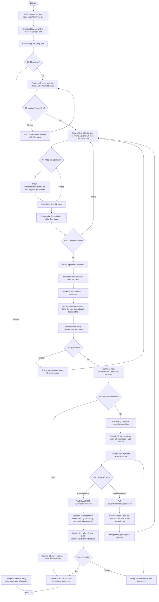
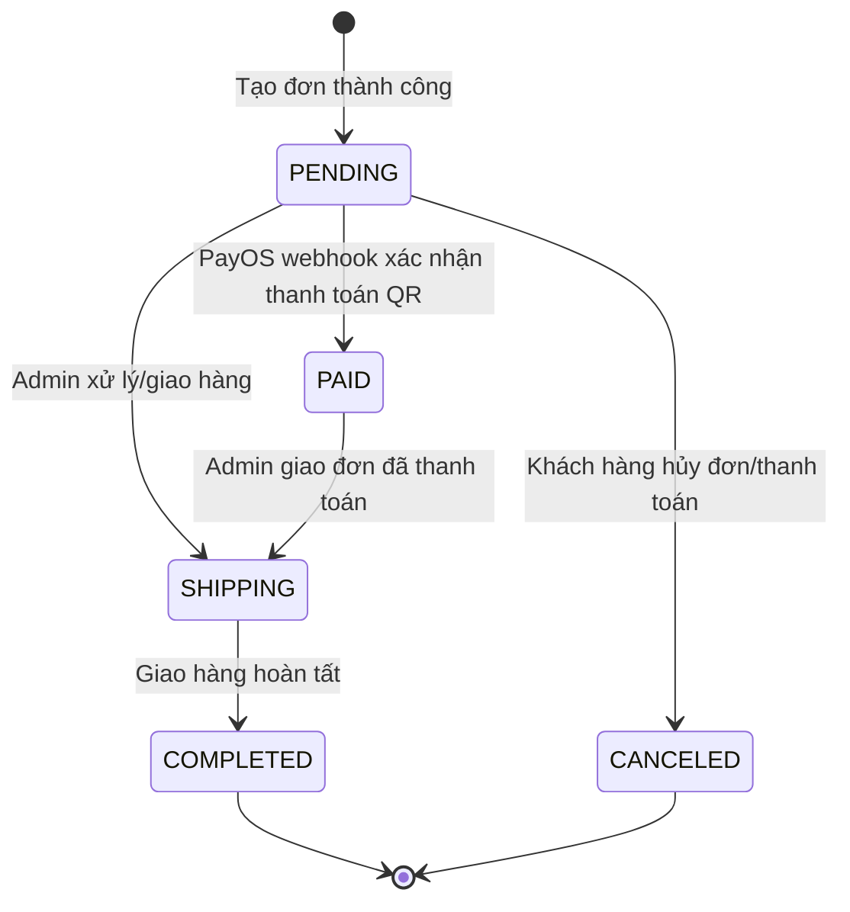

# SWT - Workflow chức năng thanh toán DPWOOD

## 1. Chức năng được chọn

**Chức năng:** Thanh toán/đặt hàng tại giỏ hàng.

**Lý do chọn:** Đây là chức năng có nhiều nhánh nghiệp vụ phù hợp cho môn SWT: kiểm tra đăng nhập, kiểm tra giỏ hàng, địa chỉ giao hàng, mã giảm giá, tồn kho, tạo đơn hàng, thanh toán COD/QR, webhook PayOS, hủy đơn và cập nhật trạng thái.

**Phạm vi workflow:** Từ lúc khách hàng đã chọn sản phẩm vào giỏ hàng đến khi đơn hàng được tạo thành công, thanh toán thành công hoặc bị hủy.

## 2. Tác nhân và thành phần hệ thống

| Thành phần | Vai trò |
| --- | --- |
| Khách hàng | Chọn sản phẩm, nhập/chọn địa chỉ, chọn phương thức thanh toán, xác nhận hoặc hủy thanh toán. |
| Frontend Next.js | Hiển thị sản phẩm, giỏ hàng, địa chỉ, modal xác nhận đơn, modal QR PayOS và màn hình thành công. |
| Backend Express | Xác thực người dùng, kiểm tra dữ liệu, tính lại giá từ database, tạo đơn hàng, xử lý webhook/cancel/status. |
| Database Sequelize | Lưu `Product`, `Order`, `OrderItem`, `Discount`, `Address`, `User`, `AuditLog`. |
| PayOS | Tạo link/mã thanh toán QR và gửi webhook khi nhận tiền. |
| Email service | Gửi email xác nhận đơn hàng hoặc email đã thanh toán. |

## 3. Điều kiện đầu vào

- Khách hàng có ít nhất một sản phẩm trong giỏ hàng.
- Khách hàng đã đăng nhập bằng tài khoản hợp lệ.
- Tài khoản không bị khóa.
- Khách hàng đã chọn hoặc thêm địa chỉ nhận hàng.
- Sản phẩm trong giỏ vẫn tồn tại trong database và còn đủ tồn kho.
- Nếu thanh toán QR, tổng tiền sau giảm giá phải từ 2.000 VNĐ trở lên theo điều kiện PayOS.

## 4. Process flow tổng quát



## 5. Luồng hoạt động chi tiết

### 5.1. Thêm sản phẩm vào giỏ

1. Khách hàng vào trang danh sách sản phẩm hoặc trang chi tiết sản phẩm.
2. Khi bấm **Mua ngay** hoặc **Thêm vào giỏ**, frontend tạo/cập nhật mảng `cart` trong `localStorage`.
3. Dữ liệu mỗi dòng giỏ hàng gồm `productId`, `name`, `price`, `imageUrl`, `quantity`.
4. Nếu bấm **Mua ngay**, hệ thống chuyển khách hàng sang `/cart`.

### 5.2. Kiểm tra điều kiện trước thanh toán

1. Trang giỏ hàng đọc dữ liệu từ `localStorage`.
2. Frontend kiểm tra token đăng nhập:
   - Nếu chưa đăng nhập: hiện cảnh báo và chuyển sang `/login`.
   - Nếu đã đăng nhập: gọi API lấy địa chỉ.
3. Nếu chưa có địa chỉ giao hàng, khách hàng phải thêm hoặc chọn địa chỉ trước khi đặt hàng.
4. Khách hàng chọn phương thức thanh toán:
   - `COD`: Thanh toán khi nhận hàng.
   - `QR`: Chuyển khoản tự động qua PayOS.
5. Nếu nhập voucher, frontend gọi `/api/discounts/validate` để kiểm tra và hiển thị số tiền giảm tạm tính. Khi checkout, backend vẫn tính lại voucher để tránh sửa dữ liệu trên trình duyệt.

### 5.3. Xác nhận và tạo đơn hàng

1. Khách hàng bấm **Tiến hành đặt hàng**.
2. Frontend mở modal xác nhận, hiển thị người nhận, số điện thoại, địa chỉ, sản phẩm, số lượng, phương thức thanh toán và tổng tiền.
3. Khi khách hàng bấm **Chốt đơn hàng**, frontend gửi request:

```json
{
  "items": [
    {
      "productId": "uuid-san-pham",
      "quantity": 1
    }
  ],
  "paymentMethod": "COD hoặc QR",
  "shippingInfo": {
    "recipientName": "Tên người nhận",
    "phoneNumber": "Số điện thoại",
    "fullAddress": "Địa chỉ giao hàng"
  },
  "discountCode": "MA_GIAM_GIA"
}
```

4. Backend xác thực token bằng `authMiddleware`.
5. Backend mở transaction để đảm bảo nếu có lỗi thì rollback toàn bộ thay đổi.
6. Backend duyệt từng sản phẩm:
   - Kiểm tra sản phẩm có tồn tại không.
   - Kiểm tra tồn kho có đủ không.
   - Tính tiền theo giá trong database, không tin giá gửi từ frontend.
   - Trừ tồn kho và chuẩn bị dữ liệu `OrderItem`.
7. Backend kiểm tra lại mã giảm giá trong database.
8. Backend tạo `Order` với trạng thái ban đầu là `PENDING`.
9. Backend tạo các dòng `OrderItem`.

### 5.4. Nhánh thanh toán COD

1. Nếu `paymentMethod = COD`, backend không gọi PayOS.
2. Backend commit transaction.
3. Backend gửi email xác nhận đơn hàng.
4. Frontend xóa giỏ hàng trong `localStorage`.
5. Frontend hiển thị màn hình đặt hàng thành công với mã đơn hàng.
6. Trạng thái đơn hàng vẫn là `PENDING`, chờ admin xử lý giao hàng/cập nhật trạng thái.

### 5.5. Nhánh thanh toán QR PayOS

1. Nếu `paymentMethod = QR`, backend kiểm tra tổng tiền sau giảm giá có đủ điều kiện PayOS không.
2. Backend gọi PayOS để tạo payment link/mã QR.
3. Backend commit transaction và trả về mã đơn hàng cùng dữ liệu thanh toán QR.
4. Frontend mở modal QR, hiển thị:
   - Mã QR.
   - Ngân hàng/BIN.
   - Chủ tài khoản.
   - Số tài khoản.
   - Số tiền.
   - Nội dung chuyển khoản.
   - Link trang thanh toán PayOS.
5. Khách hàng chuyển khoản theo thông tin QR.
6. PayOS gửi webhook về backend qua `/api/orders/webhook`.
7. Backend tìm đơn `PENDING` theo `orderCode`, đổi trạng thái thành `PAID`, ghi `AuditLog` và gửi email đã thanh toán.
8. Khách hàng bấm **Tôi đã chuyển khoản xong**, frontend gọi `/api/orders/:orderCode/status`.
9. Nếu status là `PAID`, frontend đóng modal QR, xóa giỏ hàng và hiển thị đặt hàng thành công.
10. Nếu status vẫn là `PENDING`, frontend thông báo hệ thống chưa nhận được tiền và khách hàng tiếp tục chờ.

### 5.6. Nhánh hủy thanh toán/đơn hàng

1. Khi đơn còn `PENDING`, khách hàng có thể hủy thanh toán QR hoặc hủy đơn trong trang hồ sơ.
2. Frontend gọi `/api/orders/:orderCode/cancel`.
3. Backend tìm đơn có status `PENDING`.
4. Backend hoàn lại tồn kho cho từng sản phẩm trong đơn.
5. Backend đổi trạng thái đơn thành `CANCELED`.
6. Backend ghi log `ORDER_CANCELED`.
7. Frontend đóng modal, thông báo đã hủy và giữ nguyên giỏ hàng để khách có thể chỉnh sửa/đặt lại.

## 6. Luồng ngoại lệ cần thể hiện khi kiểm thử

| Trường hợp | Kết quả mong đợi |
| --- | --- |
| Giỏ hàng trống | Không thể tiến hành đặt hàng; backend cũng trả lỗi nếu request rỗng. |
| Chưa đăng nhập | Frontend cảnh báo và chuyển sang trang đăng nhập. |
| Không có địa chỉ | Frontend yêu cầu chọn/thêm địa chỉ giao hàng. |
| Token hết hạn | Axios interceptor thử refresh token; nếu thất bại thì chuyển về `/login`. |
| Tài khoản bị khóa | Backend trả `ACCOUNT_BANNED`, frontend xóa thông tin đăng nhập và chuyển sang `/banned`. |
| Sản phẩm không tồn tại | Backend rollback transaction và trả lỗi. |
| Không đủ tồn kho | Backend rollback transaction và trả lỗi nêu sản phẩm còn bao nhiêu trong kho. |
| Voucher sai/hết hạn | Frontend báo lỗi khi validate; backend không áp dụng voucher không hợp lệ khi checkout. |
| QR dưới 2.000 VNĐ | Backend rollback và báo PayOS yêu cầu đơn QR tối thiểu 2.000 VNĐ. |
| PayOS chưa gửi webhook | Status vẫn `PENDING`, khi kiểm tra thanh toán frontend báo chưa nhận được tiền. |
| Hủy đơn `PENDING` | Đơn chuyển `CANCELED`, tồn kho được hoàn lại. |
| Hủy đơn không còn `PENDING` | Backend không cho hủy. |

## 7. API và dữ liệu chính

| API | Method | Mục đích |
| --- | --- | --- |
| `/api/addresses` | GET | Lấy danh sách địa chỉ của người dùng. |
| `/api/addresses` | POST | Thêm địa chỉ giao hàng. |
| `/api/discounts/validate` | POST | Kiểm tra mã giảm giá trước khi checkout. |
| `/api/orders/checkout` | POST | Tạo đơn hàng và khởi tạo thanh toán COD/QR. |
| `/api/orders/webhook` | POST | PayOS callback để xác nhận đã nhận tiền. |
| `/api/orders/:orderCode/status` | GET | Kiểm tra trạng thái thanh toán/đơn hàng. |
| `/api/orders/:orderCode/cancel` | PUT | Hủy đơn đang `PENDING` và hoàn tồn kho. |
| `/api/orders/me` | GET | Lấy lịch sử đơn hàng của người dùng. |
| `/api/orders/admin` | GET | Admin xem toàn bộ đơn hàng. |
| `/api/orders/admin/:id/status` | PUT | Admin cập nhật trạng thái đơn hàng. |

## 8. Trạng thái đơn hàng



## 9. Kết quả đầu ra của workflow

- Với COD: đơn hàng được tạo, trạng thái `PENDING`, giỏ hàng được xóa, khách hàng thấy màn hình đặt hàng thành công và nhận email xác nhận.
- Với QR thành công: đơn được tạo `PENDING`, sau webhook chuyển sang `PAID`, ghi lịch sử giao dịch, gửi email thanh toán, xóa giỏ hàng và hiển thị thành công.
- Với QR bị hủy: đơn chuyển `CANCELED`, tồn kho được hoàn lại, giỏ hàng vẫn được giữ để khách chỉnh sửa hoặc đặt lại.

## 10. Ghi chú cho nhóm test case/bug report

- Frontend hiện đọc dữ liệu QR bằng `response.data.paymentLink`, trong khi backend trả `payosData`. Đây là điểm cần kiểm thử vì có thể làm modal QR không hiển thị dữ liệu thanh toán.
- Hàm đổi số lượng ở giỏ hàng cần được kiểm thử kỹ vì tham số truyền giữa `CartTable` và `CartPage` có dấu hiệu bị đảo thứ tự.
- Nên kiểm thử tồn kho và số lượng đã bán khi thanh toán QR, COD và khi hủy đơn để đảm bảo dữ liệu sản phẩm không bị lệch.
- Webhook PayOS là luồng bất đồng bộ, nên test case cần có cả trạng thái trước webhook (`PENDING`) và sau webhook (`PAID`).

## 11. File code liên quan

- `client/src/app/(main)/products/page.js`: thêm sản phẩm từ danh sách vào giỏ.
- `client/src/app/(main)/products/[id]/page.js`: thêm sản phẩm từ trang chi tiết vào giỏ.
- `client/src/app/(main)/cart/page.js`: điều phối toàn bộ frontend checkout.
- `client/src/app/(main)/cart/components/CartTable.js`: hiển thị giỏ hàng, voucher và phương thức thanh toán.
- `client/src/app/(main)/cart/components/ConfirmOrderModal.js`: xác nhận đơn hàng trước checkout.
- `client/src/app/(main)/cart/components/PaymentQRModal.js`: hiển thị QR và kiểm tra/hủy thanh toán.
- `server/src/controllers/orderController.js`: xử lý checkout, webhook PayOS, kiểm tra status, hủy đơn, admin order.
- `server/src/routers/order.js`: khai báo các route đơn hàng.
- `server/src/models/order.js`: model và trạng thái đơn hàng.
- `server/src/models/orderItem.js`: chi tiết sản phẩm trong đơn.
- `server/src/controllers/discountController.js`: validate mã giảm giá.
