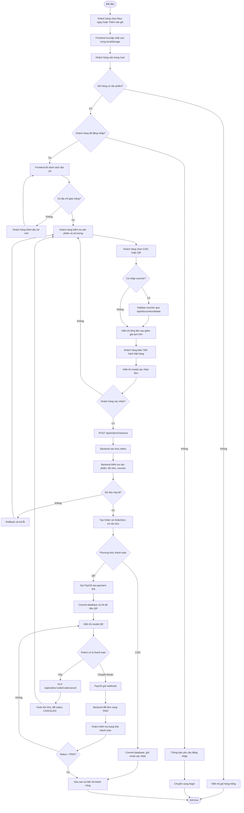
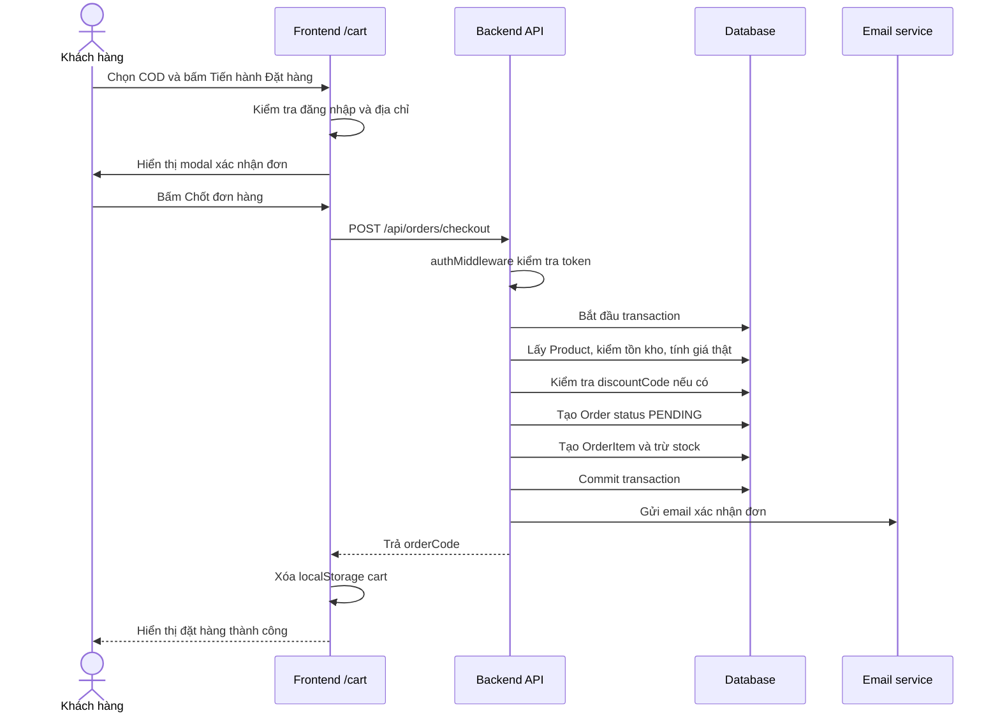
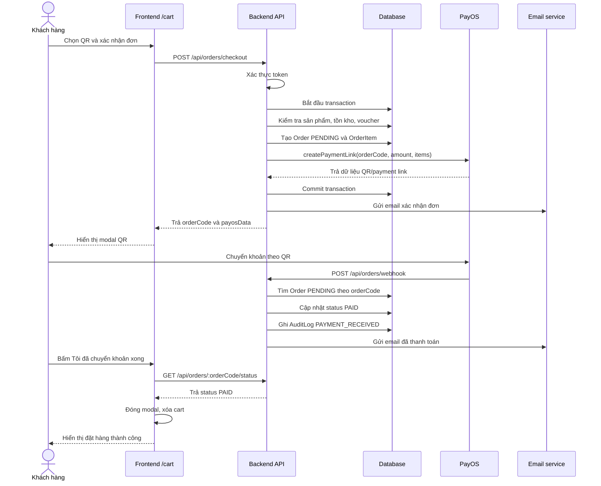
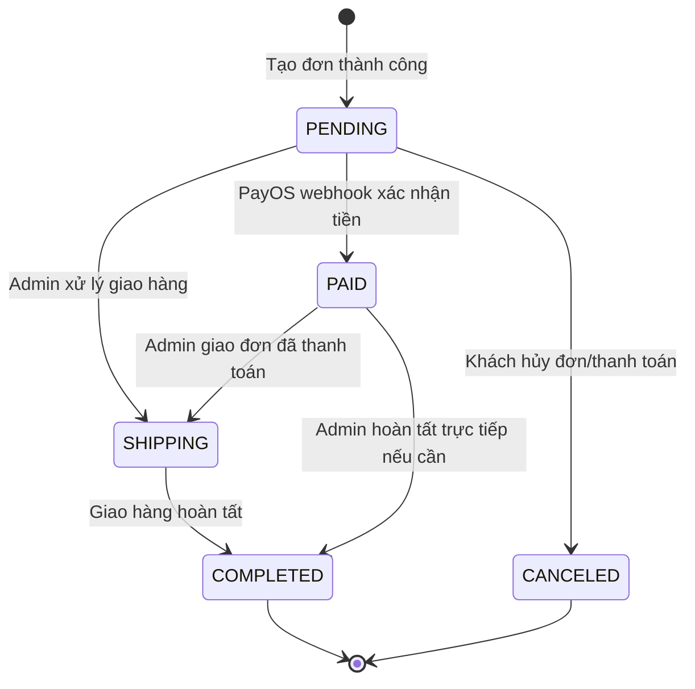

# SOFTWARE TESTING DOCUMENT

## Payment Workflow - DPWOOD

**Môn học:** Software Testing  
**Trường:** Đại học FPT  
**Vai trò thực hiện:** Người 1 - Workflow / Process Flow  
**Chức năng chọn:** Thanh toán / Đặt hàng  
**Dự án:** DPWOOD - Website bán sản phẩm gỗ/nội thất  
**Ngày lập tài liệu:** 01/07/2026  
**Phiên bản:** 1.0

---

## 1. Mục đích tài liệu

Tài liệu này mô tả workflow của chức năng **thanh toán/đặt hàng** trong hệ thống DPWOOD. Nội dung được xây dựng dựa trên source code hiện tại của dự án, nhằm phục vụ bài tập nhóm môn Software Testing.

Phần này tương ứng nhiệm vụ của **Người 1 - Workflow (Process Flow)**:

- Chọn chức năng cần kiểm thử.
- Vẽ và mô tả flow hoạt động của hệ thống.
- Giải thích luồng xử lý chính, luồng thay thế và luồng ngoại lệ.
- Cung cấp thông tin đầu vào cho các thành viên tiếp theo thiết kế test case, thực hiện kiểm thử, viết bug report và tổng kết test report.

---

## 2. Tổng quan chức năng

### 2.1. Tên chức năng

**Thanh toán / Đặt hàng tại giỏ hàng**

### 2.2. Mô tả ngắn

Khách hàng chọn sản phẩm, thêm vào giỏ hàng, chọn địa chỉ nhận hàng, nhập mã giảm giá nếu có, chọn phương thức thanh toán COD hoặc QR PayOS, sau đó xác nhận đặt hàng. Hệ thống kiểm tra đăng nhập, kiểm tra tồn kho, tính lại giá từ database, tạo đơn hàng, cập nhật trạng thái và gửi email xác nhận.

### 2.3. Lý do chọn chức năng

Chức năng thanh toán phù hợp để làm bài SWT vì có nhiều điểm cần kiểm thử:

- Có nhiều điều kiện đầu vào: đăng nhập, giỏ hàng, địa chỉ, voucher, tồn kho.
- Có nhiều nhánh nghiệp vụ: COD, QR, hủy đơn, thanh toán thành công, thanh toán chưa ghi nhận.
- Có xử lý frontend, backend, database và bên thứ ba PayOS.
- Có trạng thái đơn hàng thay đổi theo thời gian: `PENDING`, `PAID`, `SHIPPING`, `COMPLETED`, `CANCELED`.
- Có khả năng phát sinh lỗi thực tế để nhóm viết bug report.

---

## 3. Phạm vi phân tích

### 3.1. Trong phạm vi

- Thêm sản phẩm vào giỏ hàng.
- Mở trang giỏ hàng.
- Kiểm tra đăng nhập.
- Chọn/thêm địa chỉ giao hàng.
- Chỉnh số lượng và xóa sản phẩm trong giỏ.
- Áp dụng mã giảm giá.
- Chọn phương thức thanh toán COD hoặc QR.
- Xác nhận đặt hàng.
- Backend tạo đơn hàng.
- Backend kiểm tra sản phẩm, tồn kho, voucher.
- Thanh toán QR qua PayOS.
- Kiểm tra trạng thái thanh toán.
- Hủy đơn hàng khi đơn còn `PENDING`.
- Xem đơn hàng sau khi đặt.

### 3.2. Ngoài phạm vi

- Đăng ký/đăng nhập chi tiết.
- Quản trị sản phẩm.
- Quản trị voucher.
- Quản lý vận chuyển ngoài thao tác cập nhật trạng thái đơn.
- Hoàn tiền sau khi đơn đã thanh toán.
- Tích hợp thật với ngân hàng ngoài PayOS.

---

## 4. Tác nhân và hệ thống liên quan

| Tác nhân / Thành phần | Vai trò |
| --- | --- |
| Khách hàng | Thêm sản phẩm vào giỏ, chọn địa chỉ, chọn phương thức thanh toán, xác nhận/hủy đơn. |
| Frontend Next.js | Hiển thị sản phẩm, giỏ hàng, địa chỉ, voucher, modal xác nhận, modal QR và màn hình thành công. |
| Backend Express.js | Xác thực token, kiểm tra nghiệp vụ, tạo đơn hàng, xử lý webhook PayOS, kiểm tra trạng thái, hủy đơn. |
| Database Sequelize | Lưu dữ liệu người dùng, sản phẩm, địa chỉ, đơn hàng, chi tiết đơn, voucher và audit log. |
| PayOS | Tạo mã QR/link thanh toán và gửi webhook khi nhận được tiền. |
| Email service | Gửi email xác nhận đơn hàng và email thông báo đã thanh toán. |
| Admin | Theo dõi và cập nhật trạng thái đơn hàng sau khi khách đặt. |

---

## 5. File source code liên quan

| File | Vai trò trong workflow |
| --- | --- |
| `client/src/app/(main)/products/page.js` | Xử lý mua ngay từ danh sách sản phẩm. |
| `client/src/app/(main)/products/[id]/page.js` | Xử lý thêm sản phẩm vào giỏ từ trang chi tiết. |
| `client/src/app/(main)/cart/page.js` | Điều phối chính toàn bộ luồng checkout trên frontend. |
| `client/src/app/(main)/cart/components/CartTable.js` | Hiển thị giỏ hàng, số lượng, voucher, phương thức thanh toán. |
| `client/src/app/(main)/cart/components/AddressSection.js` | Hiển thị, chọn, thêm và xóa địa chỉ giao hàng. |
| `client/src/app/(main)/cart/components/ConfirmOrderModal.js` | Modal xác nhận thông tin đơn hàng trước khi checkout. |
| `client/src/app/(main)/cart/components/PaymentQRModal.js` | Modal hiển thị QR PayOS, kiểm tra thanh toán và hủy thanh toán. |
| `client/src/app/(main)/cart/components/SuccessResult.js` | Màn hình đặt hàng thành công. |
| `client/src/app/(main)/profile/components/MyOrders.js` | Hiển thị lịch sử đơn hàng và hủy đơn đang chờ xử lý. |
| `server/src/routers/order.js` | Khai báo các route liên quan đến đơn hàng. |
| `server/src/controllers/orderController.js` | Xử lý checkout, webhook, status, cancel và admin order. |
| `server/src/models/order.js` | Model đơn hàng và trạng thái đơn hàng. |
| `server/src/models/orderItem.js` | Model chi tiết sản phẩm trong đơn. |
| `server/src/controllers/discountController.js` | Validate mã giảm giá. |
| `server/src/models/discount.js` | Model mã giảm giá. |
| `server/src/middlewares/authMiddleware.js` | Xác thực token người dùng trước checkout/cancel. |

---

## 6. Điều kiện nghiệp vụ

### 6.1. Pre-condition

Trước khi bắt đầu thanh toán:

- Khách hàng đã có sản phẩm trong giỏ hàng.
- Sản phẩm có thông tin `productId`, `name`, `price`, `imageUrl`, `quantity`.
- Khách hàng phải đăng nhập để đặt hàng.
- Tài khoản khách hàng không bị khóa.
- Khách hàng phải có địa chỉ giao hàng.
- Sản phẩm trong giỏ vẫn còn tồn tại trong database.
- Tồn kho của từng sản phẩm phải đủ với số lượng đặt.

### 6.2. Post-condition

Sau khi kết thúc workflow:

| Trường hợp | Kết quả |
| --- | --- |
| COD thành công | Tạo đơn `PENDING`, trừ tồn kho, gửi email xác nhận, xóa giỏ hàng. |
| QR tạo đơn thành công nhưng chưa chuyển khoản | Tạo đơn `PENDING`, trừ tồn kho, hiển thị QR cho khách thanh toán. |
| QR thanh toán thành công | Đơn chuyển `PAID`, ghi audit log, gửi email đã thanh toán, xóa giỏ hàng. |
| Khách hủy đơn/QR | Đơn chuyển `CANCELED`, hoàn lại tồn kho, giữ giỏ hàng để khách chỉnh sửa/đặt lại. |
| Lỗi dữ liệu hoặc tồn kho | Không tạo đơn, rollback thay đổi database, hiển thị lỗi cho khách. |

---

## 7. Dữ liệu vào và dữ liệu ra

### 7.1. Dữ liệu vào từ frontend

Khi khách hàng xác nhận đặt hàng, frontend gửi request đến `/api/orders/checkout`:

```json
{
  "items": [
    {
      "productId": "uuid-san-pham",
      "quantity": 1
    }
  ],
  "paymentMethod": "COD",
  "shippingInfo": {
    "recipientName": "Nguyen Van A",
    "phoneNumber": "0912345678",
    "fullAddress": "Hoa Lac, Thach That, Ha Noi"
  },
  "discountCode": "SALE10"
}
```

### 7.2. Dữ liệu backend tự tính lại

Backend không tin hoàn toàn dữ liệu giá từ frontend. Khi checkout, backend sẽ:

- Lấy sản phẩm thật từ database bằng `productId`.
- Kiểm tra sản phẩm có tồn tại không.
- Kiểm tra tồn kho.
- Lấy giá thật từ database.
- Tính `subTotal`.
- Kiểm tra lại mã giảm giá trong database.
- Tính `finalTotalAmount`.
- Tạo `Order` và `OrderItem`.

### 7.3. Dữ liệu ra

Khi thành công, backend trả về:

```json
{
  "message": "Đặt hàng thành công",
  "orderCode": 123456,
  "payosData": {
    "qrCode": "du-lieu-qr",
    "checkoutUrl": "https://pay.payos.vn/...",
    "amount": 500000,
    "description": "Thanh toan don #123456"
  }
}
```

Với COD, `payosData` có thể là `null`. Với QR, `payosData` chứa dữ liệu dùng để hiển thị mã QR.

---

## 8. Use case specification

| Mục | Nội dung |
| --- | --- |
| Use case ID | UC-PAYMENT-01 |
| Use case name | Thanh toán / Đặt hàng |
| Primary actor | Khách hàng |
| Supporting actor | PayOS, Email service, Admin |
| Trigger | Khách hàng bấm nút `Tiến hành Đặt hàng` ở trang giỏ hàng. |
| Pre-condition | Khách hàng đã đăng nhập, giỏ hàng có sản phẩm, có địa chỉ giao hàng, sản phẩm còn tồn kho. |
| Main success scenario | Khách hàng xác nhận đơn, hệ thống tạo đơn thành công, thanh toán COD hoặc QR thành công. |
| Alternative scenario | Khách hủy thanh toán, QR chưa được ghi nhận, voucher không hợp lệ, chưa đăng nhập. |
| Post-condition | Đơn hàng được tạo/cập nhật trạng thái, tồn kho thay đổi đúng, khách nhận thông báo phù hợp. |
| Business value | Cho phép khách hoàn tất mua hàng và hệ thống ghi nhận doanh thu/đơn hàng. |

---

## 9. Activity diagram - Luồng tổng quát



---

## 10. Sequence diagram - Thanh toán COD



---

## 11. Sequence diagram - Thanh toán QR PayOS



---

## 12. State diagram - Trạng thái đơn hàng



### Ý nghĩa trạng thái

| Trạng thái | Ý nghĩa |
| --- | --- |
| `PENDING` | Đơn vừa được tạo, chờ xử lý hoặc chờ thanh toán. |
| `PAID` | Đơn QR đã được PayOS xác nhận thanh toán. |
| `SHIPPING` | Đơn đang trong quá trình giao hàng. |
| `COMPLETED` | Đơn đã hoàn tất. |
| `CANCELED` | Đơn đã bị hủy và không tiếp tục xử lý. |

---

## 13. Main flow - Luồng thành công chính

### 13.1. Luồng COD thành công

| Bước | Actor | Hành động | Kết quả mong đợi |
| --- | --- | --- | --- |
| 1 | Khách hàng | Chọn sản phẩm và bấm `Mua ngay` hoặc `Thêm vào giỏ` | Sản phẩm được lưu vào `localStorage cart`. |
| 2 | Khách hàng | Mở trang `/cart` | Hệ thống hiển thị danh sách sản phẩm trong giỏ. |
| 3 | Frontend | Kiểm tra trạng thái đăng nhập | Nếu có token hợp lệ thì tiếp tục. |
| 4 | Frontend | Tải địa chỉ qua `/api/addresses` | Hiển thị địa chỉ mặc định hoặc danh sách địa chỉ. |
| 5 | Khách hàng | Chọn `COD` | Phương thức thanh toán được lưu ở state frontend. |
| 6 | Khách hàng | Bấm `Tiến hành Đặt hàng` | Modal xác nhận đơn hàng được mở. |
| 7 | Khách hàng | Bấm `Chốt đơn hàng` | Frontend gửi request checkout. |
| 8 | Backend | Kiểm tra token, sản phẩm, tồn kho, voucher | Dữ liệu hợp lệ, transaction tiếp tục. |
| 9 | Backend | Tạo `Order`, `OrderItem`, trừ tồn kho | Đơn hàng được tạo với status `PENDING`. |
| 10 | Backend | Commit transaction và gửi email | Dữ liệu được lưu, khách nhận email xác nhận. |
| 11 | Frontend | Nhận `orderCode` | Xóa cart và hiển thị đặt hàng thành công. |

### 13.2. Luồng QR thành công

| Bước | Actor | Hành động | Kết quả mong đợi |
| --- | --- | --- | --- |
| 1 | Khách hàng | Chọn sản phẩm, mở giỏ hàng, chọn địa chỉ | Điều kiện checkout hợp lệ. |
| 2 | Khách hàng | Chọn `Chuyển khoản QR` | Phương thức thanh toán là `QR`. |
| 3 | Khách hàng | Xác nhận đặt hàng | Frontend gửi request checkout. |
| 4 | Backend | Kiểm tra dữ liệu và tạo đơn `PENDING` | Đơn được tạo và tồn kho bị trừ. |
| 5 | Backend | Gọi PayOS `createPaymentLink` | PayOS trả dữ liệu QR/payment link. |
| 6 | Frontend | Hiển thị modal QR | Khách thấy mã QR, số tiền, nội dung chuyển khoản. |
| 7 | Khách hàng | Chuyển khoản theo QR | PayOS nhận tiền. |
| 8 | PayOS | Gửi webhook về backend | Backend cập nhật đơn sang `PAID`. |
| 9 | Khách hàng | Bấm `Tôi đã chuyển khoản xong` | Frontend gọi API kiểm tra status. |
| 10 | Frontend | Nhận status `PAID` | Đóng modal, xóa cart, hiển thị thành công. |

---

## 14. Alternative flow - Luồng thay thế

### AF-01: Khách chưa đăng nhập

| Bước | Mô tả |
| --- | --- |
| 1 | Khách hàng vào `/cart` và bấm `Tiến hành Đặt hàng`. |
| 2 | Frontend kiểm tra không có token đăng nhập. |
| 3 | Hệ thống hiển thị cảnh báo yêu cầu đăng nhập. |
| 4 | Hệ thống chuyển khách hàng sang `/login`. |
| Kết quả | Không tạo đơn hàng. |

### AF-02: Khách chưa có địa chỉ giao hàng

| Bước | Mô tả |
| --- | --- |
| 1 | Khách hàng đã đăng nhập và có sản phẩm trong giỏ. |
| 2 | Frontend không tìm thấy `selectedAddress`. |
| 3 | Hệ thống yêu cầu khách thêm hoặc chọn địa chỉ giao hàng. |
| 4 | Khách thêm địa chỉ qua form. |
| 5 | Frontend gọi API lưu địa chỉ, sau đó tải lại danh sách địa chỉ. |
| Kết quả | Khách có thể tiếp tục checkout sau khi có địa chỉ. |

### AF-03: Khách áp dụng mã giảm giá hợp lệ

| Bước | Mô tả |
| --- | --- |
| 1 | Khách nhập voucher ở giỏ hàng. |
| 2 | Frontend gọi `POST /api/discounts/validate`. |
| 3 | Backend kiểm tra voucher có tồn tại, đang hoạt động, chưa hết hạn. |
| 4 | Frontend hiển thị số tiền giảm tạm tính. |
| 5 | Khi checkout, backend kiểm tra lại voucher lần nữa. |
| Kết quả | Đơn hàng được giảm tiền theo phần trăm hợp lệ. |

### AF-04: QR chưa ghi nhận tiền

| Bước | Mô tả |
| --- | --- |
| 1 | Khách chuyển khoản hoặc vừa bấm kiểm tra quá sớm. |
| 2 | Frontend gọi `GET /api/orders/:orderCode/status`. |
| 3 | Backend trả status vẫn là `PENDING`. |
| 4 | Frontend thông báo hệ thống chưa nhận được tiền. |
| Kết quả | Modal QR vẫn mở, khách tiếp tục chờ hoặc kiểm tra lại. |

### AF-05: Khách hủy thanh toán QR

| Bước | Mô tả |
| --- | --- |
| 1 | Đơn QR đã được tạo với status `PENDING`. |
| 2 | Khách bấm `Hủy thanh toán đơn này`. |
| 3 | Frontend gọi `PUT /api/orders/:orderCode/cancel`. |
| 4 | Backend hoàn lại tồn kho từng sản phẩm. |
| 5 | Backend đổi đơn sang `CANCELED` và ghi audit log. |
| Kết quả | Modal đóng, giỏ hàng vẫn còn để khách chỉnh sửa/đặt lại. |

---

## 15. Exception flow - Luồng lỗi

| Mã | Điều kiện lỗi | Nơi xử lý | Kết quả mong đợi |
| --- | --- | --- | --- |
| EF-01 | Giỏ hàng rỗng | Frontend/Backend | Không tạo đơn, báo giỏ hàng không được để trống. |
| EF-02 | Token không hợp lệ/hết hạn | `authMiddleware` / axios interceptor | Thử refresh token; nếu thất bại chuyển về `/login`. |
| EF-03 | Tài khoản bị khóa | `authMiddleware` | Trả `ACCOUNT_BANNED`, frontend chuyển sang `/banned`. |
| EF-04 | Sản phẩm không tồn tại | `checkout` backend | Rollback transaction, trả lỗi. |
| EF-05 | Tồn kho không đủ | `checkout` backend | Rollback transaction, báo sản phẩm chỉ còn số lượng hiện có. |
| EF-06 | Voucher không tồn tại | `validateDiscount` / `checkout` | Frontend báo lỗi; backend không áp dụng voucher. |
| EF-07 | Voucher hết hạn | `validateDiscount` / `checkout` | Frontend báo mã hết hạn; backend không áp dụng voucher. |
| EF-08 | Tổng tiền QR dưới 2.000 VNĐ | `checkout` backend | Rollback và báo điều kiện tối thiểu của PayOS. |
| EF-09 | PayOS không tạo được payment link | `checkout` backend | Rollback transaction, trả lỗi tạo đơn/thanh toán. |
| EF-10 | Hủy đơn không còn `PENDING` | `cancelOrder` backend | Không cho hủy, trả lỗi. |
| EF-11 | PayOS webhook gửi orderCode không tồn tại | `handleWebhook` backend | Trả success để tránh retry vô hạn, không cập nhật đơn. |

---

## 16. API mapping

| API | Method | Auth | Mục đích | Kết quả chính |
| --- | --- | --- | --- | --- |
| `/api/addresses` | GET | Có | Lấy địa chỉ của user | Danh sách địa chỉ. |
| `/api/addresses` | POST | Có | Thêm địa chỉ mới | Địa chỉ mới được lưu. |
| `/api/addresses/:id` | DELETE | Có | Xóa địa chỉ | Địa chỉ bị xóa. |
| `/api/discounts/validate` | POST | Không bắt buộc | Kiểm tra mã giảm giá | Trả percentage/description hoặc lỗi. |
| `/api/orders/checkout` | POST | Có | Tạo đơn hàng | Trả orderCode và dữ liệu PayOS nếu QR. |
| `/api/orders/webhook` | POST | Không | PayOS xác nhận thanh toán | Đơn chuyển `PAID`. |
| `/api/orders/:orderCode/status` | GET | Không | Kiểm tra trạng thái đơn | Trả `status`. |
| `/api/orders/:orderCode/cancel` | PUT | Có | Hủy đơn còn `PENDING` | Đơn chuyển `CANCELED`, hoàn stock. |
| `/api/orders/me` | GET | Có | User xem đơn của mình | Danh sách đơn hàng. |
| `/api/orders/admin` | GET | Admin/root | Admin xem toàn bộ đơn | Danh sách đơn hàng. |
| `/api/orders/admin/:id/status` | PUT | Admin/root | Admin cập nhật trạng thái | Trạng thái đơn được cập nhật. |

---

## 17. Business rules

| Mã rule | Quy tắc |
| --- | --- |
| BR-01 | Khách hàng phải đăng nhập mới được checkout. |
| BR-02 | Khách hàng phải có địa chỉ giao hàng mới được checkout. |
| BR-03 | Backend phải tính lại giá theo database, không dùng giá từ frontend. |
| BR-04 | Backend phải kiểm tra tồn kho trước khi tạo đơn. |
| BR-05 | Nếu có lỗi trong checkout, transaction phải rollback toàn bộ. |
| BR-06 | Đơn mới tạo có trạng thái mặc định `PENDING`. |
| BR-07 | Thanh toán COD không gọi PayOS. |
| BR-08 | Thanh toán QR phải gọi PayOS để tạo payment link. |
| BR-09 | Đơn QR chỉ chuyển `PAID` khi PayOS webhook xác nhận. |
| BR-10 | Chỉ đơn `PENDING` mới được hủy. |
| BR-11 | Khi hủy đơn `PENDING`, hệ thống phải hoàn lại tồn kho. |
| BR-12 | Voucher phải tồn tại, active và chưa hết hạn mới được áp dụng. |
| BR-13 | Tổng tiền thanh toán QR phải từ 2.000 VNĐ trở lên. |
| BR-14 | Sau khi đặt hàng/thanh toán thành công, giỏ hàng trên frontend được xóa. |

---

## 18. Database impact

| Model | Thao tác trong workflow |
| --- | --- |
| `Product` | Đọc giá/tồn kho; trừ stock khi tạo đơn; hoàn stock khi hủy đơn. |
| `Order` | Tạo đơn mới; cập nhật status `PAID`, `CANCELED`, `SHIPPING`, `COMPLETED`. |
| `OrderItem` | Lưu từng sản phẩm trong đơn với số lượng và giá tại thời điểm mua. |
| `Discount` | Kiểm tra mã giảm giá, phần trăm giảm và ngày hết hạn. |
| `Address` | Lấy địa chỉ giao hàng của user. |
| `User` | Xác thực người dùng và lấy email gửi thông báo. |
| `AuditLog` | Ghi log thanh toán PayOS và hủy đơn. |

---

## 19. Điểm cần lưu ý khi chuyển sang test case

Nhóm thiết kế test case nên ưu tiên các nhóm kiểm thử sau:

| Nhóm test | Nội dung cần test |
| --- | --- |
| Authentication | Chưa đăng nhập, token hết hạn, tài khoản bị khóa. |
| Cart | Giỏ rỗng, nhiều sản phẩm, tăng/giảm số lượng, xóa sản phẩm. |
| Address | Không có địa chỉ, thêm địa chỉ mới, chọn địa chỉ khác, xóa địa chỉ. |
| Discount | Mã hợp lệ, không tồn tại, hết hạn, inactive, discount lớn. |
| Inventory | Sản phẩm hết hàng, không đủ hàng, sản phẩm bị xóa trước checkout. |
| COD payment | Tạo đơn COD thành công, email, trạng thái `PENDING`, xóa cart. |
| QR payment | Tạo QR, hiển thị QR, webhook `PAID`, kiểm tra status, xóa cart. |
| Cancel order | Hủy QR, hủy từ profile, hoàn stock, không cho hủy đơn đã thanh toán/hoàn tất. |
| Admin order | Admin xem đơn và cập nhật trạng thái. |
| Data integrity | Transaction rollback khi lỗi, không trừ stock sai, không tạo đơn thiếu item. |

---

## 20. Rủi ro/bug tiềm năng phát hiện từ source code

Các điểm dưới đây không phải kết luận bug chính thức, nhưng nên được chuyển cho nhóm test case và bug report kiểm tra:

| Mã | Rủi ro | Lý do cần test |
| --- | --- | --- |
| R-01 | Modal QR có thể không nhận dữ liệu thanh toán | Frontend dùng `response.data.paymentLink`, nhưng backend trả `payosData`. |
| R-02 | Đổi số lượng trong giỏ có thể sai sản phẩm/sai giá trị | Hàm `handleQuantityChange(value, productId)` ở page nhận thứ tự khác với cách `CartTable` gọi. |
| R-03 | Số lượng `sold` có thể bị tăng không đúng trong luồng QR | Checkout đã tăng `sold`, webhook QR lại tiếp tục tăng `sold`. |
| R-04 | `OrderItem` model không có field `name`, nhưng email/webhook dùng tên sản phẩm theo dữ liệu tạm | Cần kiểm tra email/hiển thị chi tiết đơn có đúng tên sản phẩm không. |
| R-05 | Route status không có auth | Cần xem yêu cầu bảo mật: người ngoài có thể kiểm tra status nếu biết `orderCode`. |
| R-06 | `returnUrl` và `cancelUrl` PayOS hardcode `localhost:3000` | Khi deploy có thể sai URL môi trường production. |

---

## 21. Acceptance criteria

Chức năng thanh toán được xem là đạt khi:

- Khách chưa đăng nhập không thể checkout.
- Khách không có địa chỉ không thể checkout.
- Hệ thống tạo đơn thành công với phương thức COD.
- Hệ thống tạo QR thành công với phương thức QR.
- Backend tính đúng tổng tiền dựa trên giá trong database.
- Backend áp dụng voucher hợp lệ và bỏ qua voucher không hợp lệ.
- Backend không tạo đơn khi sản phẩm không tồn tại hoặc không đủ tồn kho.
- Khi tạo đơn thành công, `Order` và `OrderItem` được lưu đúng.
- Khi hủy đơn `PENDING`, tồn kho được hoàn lại.
- Khi PayOS webhook thành công, đơn QR chuyển sang `PAID`.
- Frontend hiển thị thông báo phù hợp với từng trạng thái.
- Giỏ hàng được xóa sau khi đặt hàng/thanh toán thành công.

---

## 22. Kết luận

Workflow thanh toán của DPWOOD là một luồng nghiệp vụ quan trọng vì liên quan trực tiếp đến dữ liệu đơn hàng, tồn kho, thanh toán và trải nghiệm khách hàng. Luồng có hai nhánh chính là **COD** và **QR PayOS**. COD đơn giản hơn vì chỉ cần tạo đơn `PENDING`, còn QR cần thêm bước tạo mã thanh toán, nhận webhook và cập nhật trạng thái `PAID`.

Tài liệu này cung cấp đủ thông tin cho các vai trò còn lại trong nhóm:

- **Người 2:** Dựa vào main flow, alternative flow và exception flow để thiết kế test case.
- **Người 3:** Dựa vào API mapping và expected result để thực hiện kiểm thử.
- **Người 4:** Dựa vào rủi ro/bug tiềm năng để xác minh và viết bug report nếu phát hiện lỗi.
- **Người 5:** Dựa vào acceptance criteria và kết quả test để tổng hợp test report.

---

## 23. Phụ lục - Checklist nhanh cho phần trình bày

- Chức năng chọn: Thanh toán / Đặt hàng.
- Actor chính: Khách hàng.
- Hệ thống liên quan: Frontend, Backend, Database, PayOS, Email.
- Pre-condition quan trọng: Đăng nhập, có giỏ hàng, có địa chỉ, đủ tồn kho.
- Main flow: Thêm vào giỏ -> mở cart -> chọn địa chỉ -> chọn thanh toán -> xác nhận -> backend tạo đơn.
- Nhánh COD: Tạo đơn `PENDING`, gửi email, xóa cart.
- Nhánh QR: Tạo QR -> chờ webhook -> `PAID` -> xóa cart.
- Nhánh hủy: Chỉ hủy `PENDING`, hoàn tồn kho, status `CANCELED`.
- Điểm cần test mạnh: voucher, tồn kho, QR webhook, hủy đơn, mismatch dữ liệu QR.
